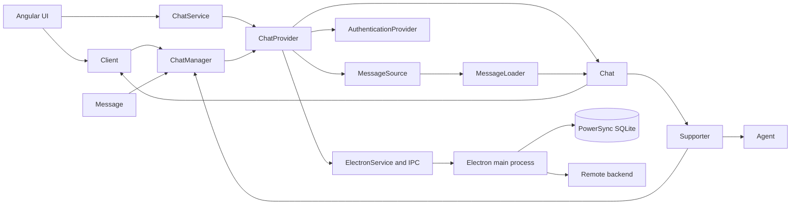
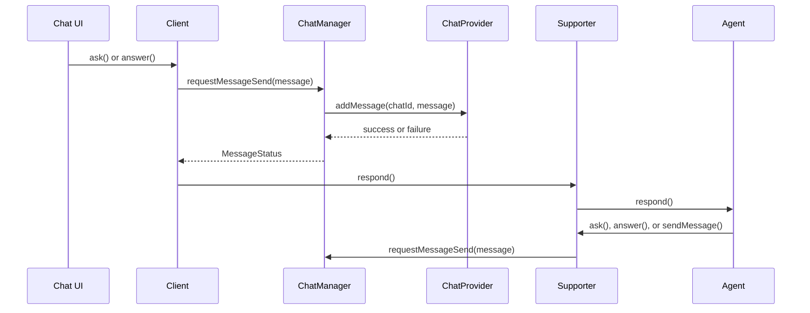

# Architecture

AI Chat separates conversation state from persistence and desktop infrastructure. This lets an agent remain independent of the backend that stores its chat.

## High-level structure

## Renderer and main-process boundary

The Angular renderer owns components, chat-domain objects, and provider-facing services under `src/`. It cannot access Node or Electron APIs directly.

`preload.js` exposes a narrow `window.electronAPI` bridge with two operations:

- `invoke(channel, payload)` for request-response IPC;
- `on(channel, listener)` for main-process events, returning an unsubscribe function.

`ElectronService` wraps that bridge and re-enters Angular's zone when requests complete or events arrive. Electron handlers under `ipc/` call main-process services under `services/`, where database, authentication, and synchronization operations run.

## Conversation flow

The participant APIs append the message before asking the manager to persist it. A failed operation therefore remains visible with `MessageStatus.Failed`, allowing the UI to present retry behavior.

## Ownership boundaries

| Layer | Owns | Does not own |
| --- | --- | --- |
| `Agent` | Conversation decisions and flow-specific runtime behavior | Database and provider implementation details |
| `Chat` | UI-facing conversation state and participant composition | Pagination policy and backend I/O |
| `Message` | Message state and edit/delete/retry entry points | Direct persistence calls |
| `ChatManager` | Mutation policy and status translation | Chat discovery and authentication UI |
| `ChatProvider` | Chat hydration, persistence, backend ownership, and authentication | Conversation decisions |
| `MessageSource` | One history segment's pagination and hydration | Source sequencing |
| `MessageLoader` | Sequential source orchestration and in-flight deduplication | Backend-specific queries |
| `AuthenticationProvider` | Session and synchronization state | Chat-domain mutation logic |
| `ChatService` | Application chat collection, selection, and provider-scoped lifecycle | Provider-specific storage operations |

## Registration

Agents and providers are registered explicitly at application bootstrap:

- `AppAgentsModule` supplies the stable agent-name catalog through `provideAgents(...)`.
- `AppChatProvidersModule` contributes providers through the `CHAT_PROVIDER` multi token.
- `app.config.ts` installs both catalogs.

Explicit registration makes enabled integrations inspectable and lets startup fail close to a missing or invalid catalog rather than relying on runtime discovery.

## Hydration order

A provider restores a chat in this order:

1. Restore the supporter and its context.
2. Create the provider-specific manager.
3. Construct the chat.
4. Install entity save handlers.
5. Add history sources.
6. Load the initial message chunk.
7. Initialize the restored agent with `isNewChat = false`.

New chats use the same shape but initialize the agent with `isNewChat = true`. Creation intent must remain explicit because an asynchronously hydrated chat can temporarily have an empty message array.

## State categories

The framework uses three distinct state categories:

- ordinary Angular signals for local UI or runtime state;
- `SyncedSignal` for model state that should trigger persistence;
- persisted supporter context for flow state that must survive agent reconstruction.

See [Signals and persistence](state/signals.md) for the synchronization contract and [Supporter context](participants/context-and-switching.md) for flow-state ownership.

## Internal seams

Some properties, such as `Chat.manager`, are marked `@internal` because collaborating domain classes need them. Extensions should use public operations such as `Message.edit()`, `Message.delete()`, participant send methods, and `Chat.processFileUrl()` instead of indexing into internal properties.
