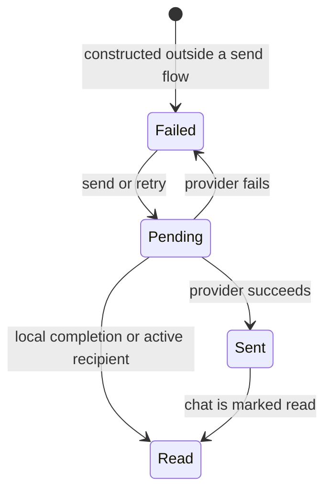

# Message lifecycle

A message moves through participant, manager, provider, and UI layers. Domain objects never write directly to a backend.

## Delivery statuses

`MessageStatus` has four values:

| Status | Meaning |
| --- | --- |
| `Pending` | The manager is processing a send, edit, or delete request. |
| `Sent` | The provider accepted or persisted the operation. |
| `Read` | The message has been read, or a local manager completed it immediately. |
| `Failed` | The manager could not complete the operation. |



The constructor defaults to `Failed` because a standalone message has not been sent. Participant methods immediately route it through the manager, which applies `Pending` and then the final result.

## Sending

Send through the participant that owns the message:

```ts
await chat.user.ask(new Question('Can you help me?'));
await chat.user.answer(new Answer('Yes'));
await chat.supporter.sendMessage(new Message('I can help.'));
```

The participant:

1. assigns `from`;
2. connects the message to its chat;
3. appends it to `chat.messages`;
4. calls `manager.requestMessageSend(...)`;
5. emits `onMessageAdded` only if the operation succeeds.

A successful client send then triggers `supporter.respond()`. A successful supporter send increments the unread count when the chat is inactive, or marks the message read when the chat is active.

## Editing

Call:

```ts
const changed = await message.edit('Corrected value');
```

Editing returns `false` when:

- `editable()` is false;
- the message belongs to the supporter;
- the message has not been attached to a chat;
- the new value is unchanged;
- the manager reports `Failed`.

The manager receives both the proposed message and a clone of its previous state. After success, the message records `editedAt` and emits `chat.onMessageEdited`. The base agent handles that event by deleting later messages and rebuilding the flow from the edited point.

## Deleting

Call:

```ts
const deleted = await message.delete();
```

Deletion returns `false` when the message is not deletable, has no chat, or the manager reports failure. After success it emits `chat.onMessageDeleted` and removes the object from the loaded message array.

Providers should delete by stable message ID. If a send and delete can race, the manager must wait for the pending create operation before requesting deletion.

## Retrying

`retry()` repeats the message's most recent manager action:

```ts
await message.retry();
```

The remembered action is initially send, then changes to edit or delete when those operations are attempted. Backends should therefore make operations idempotent where possible and use stable IDs to avoid duplicate records.

The current method returns the manager result directly. Callers should rely on the updated `status()` rather than assuming every retry succeeded.

## Cloning

`clone()` creates the same concrete message subclass with the current signal values copied into constructor options:

```ts
const snapshot = message.clone();
```

The chat reference and remembered retry action are intentionally omitted. Managers use clones to retain the pre-edit state. A clone must be sent before edit, delete, or retry operations can work.

## Events

The framework exposes events at two levels:

| Event | Emitted when |
| --- | --- |
| `Client.onMessageAdded` | A client send succeeds. |
| `Client.onAnswerSelected` | The UI selects one or more possible answers. |
| `Supporter.onMessageAdded` | A supporter send succeeds. |
| `Chat.onMessageEdited` | A message edit succeeds. |
| `Chat.onMessageDeleted` | A message deletion succeeds. |

Subscriptions owned by an agent are installed by `Agent.init(...)` and removed by `Agent.onDestroy()`.

## Persistence and hydration

A provider must persist the status, sender, timestamps, editability, deletability, attachment, and concrete message type. Hydration must call `message.setChat(chat)` and install a save handler if later synced-signal changes should be persisted.

See [Signals and persistence](../state/signals.md) for the save-handler contract.
